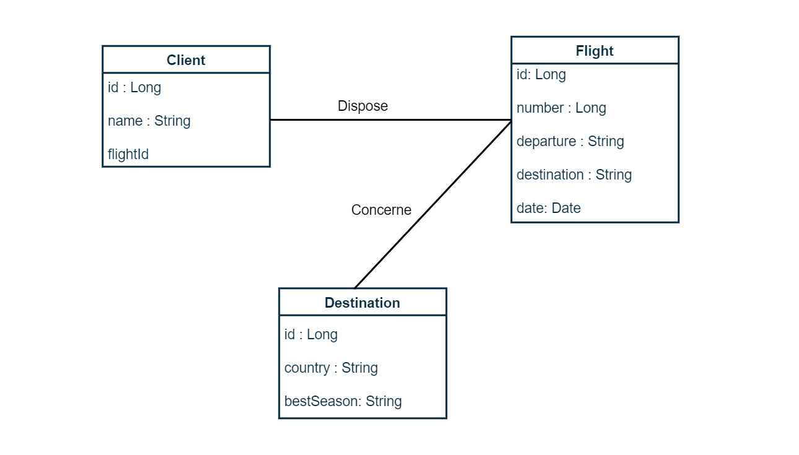
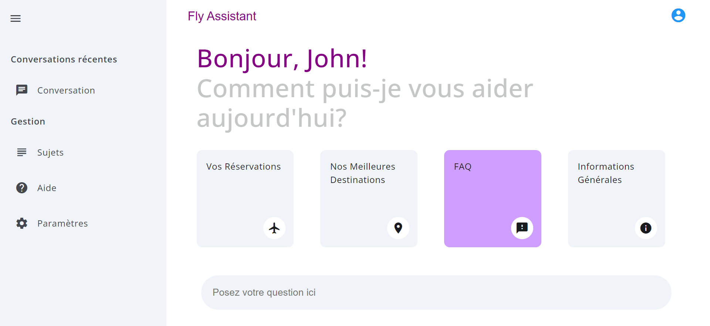

# Intégration de l'IA Générative avec Spring AI et OpenAI

Ce repo contient une application démontrant l'intégration de l'IA générative dans une application Spring Boot en
utilisant OpenAI.

Cette application combine les notions (RAG, Appel de fonctions, etc.) de Spring AI, précédemment abordées :

- [Spring Boot et IA Générative : Un Duo Innovant avec Spring AI](https://www.linkedin.com/pulse/spring-boot-et-ia-g%25C3%25A9n%25C3%25A9rative-un-duo-innovant-avec-ai-ali-ibrahim-mso7e/?trackingId=oDUZ7rJoRCK6MSND7tIDCQ%3D%3D)
- [Architecture et Implémentation de la génération augmentée par récupération (RAG) avec Spring AI](https://www.linkedin.com/pulse/architecture-et-impl%25C3%25A9mentation-de-la-g%25C3%25A9n%25C3%25A9ration-par-rag-ali-ibrahim-xgu1e/?trackingId=oDUZ7rJoRCK6MSND7tIDCQ%3D%3D)
- [Fine-Tuning et Appel de Fonctions avec OpenAI et Spring AI](https://www.linkedin.com/pulse/fine-tuning-et-appel-de-fonctions-avec-openai-spring-ai-ali-ibrahim-0f15e/?trackingId=oDUZ7rJoRCK6MSND7tIDCQ%3D%3D)

## Comprendre le projet

Pour mieux comprendre l'aspect fonctionnel du projet, vous pouvez vous référer au prompt
system : ``main-system-message.st``. Vous pouvez également consulter les articles précédents mentionnés ci-haut.

## Partie Backend (Ce Repos)

La partie backend est un projet Spring MVC classique avec Spring Boot utilisant Maven. Les dépendances sont
accessibles via le ```pom.xml```

### Prérequis

Avant de démarrer le projet, il est impératif d'avoir une clé API d'OpenAI. Pour obtenir cette clé, vous pouvez
consulter la [documentation des clés API d'OpenAI](https://platform.openai.com/api-keys). Une fois obtenue, vous pouvez
soit l'exporter dans une variable d'environnement, soit la renseigner dans le fichier `application.properties`.

````
#Exporter la clé dans la variable d'environnement OPENAI_API_KEY
spring.ai.openai.api-key=${OPENAI_API_KEY:renseignez-la-ici}
````

**Note :** Ce projet utilise la version 1.0.0-SNAPSHOT de Spring AI, ce qui pourrait entraîner des divergences au
niveau des exemples si vous utilisez
une version ultérieure. En cas de divergences, vous avez deux options :

- Si vous générez le projet avec [Spring Initializer](https://start.spring.io/), vous pouvez vous assurer de travailler
  avec la même version que moi en consultant le fichier `pom.xml` du projet.
- Si cette version snapshot n'est plus disponible, vous pouvez simplement consulter la documentation de Spring AI de la
  version que vous utilisez, pour voir les divergences.

### Lancer le projet

Démarrez le serveur, soit dans votre IDE ``SpringGenAiApplication``, soit avec ``mvn spring-boot:run``.
Les endpoints sont accessibles depuis http://localhost:8080

### Endpoints

Il y a deux types d'endpoints :

#### Les endpoints de chat

Ils sont contenus dans ``AssistantController``.

- POST: http://localhost:8080/api/assistant/informations
- POST: http://localhost:8080/api/assistant/reservations
- POST: http://localhost:8080/api/assistant/destinations
- POST: http://localhost:8080/api/assistant/faq

#### Les endpoints d'historisation des chats

Ils sont contenus ``ConversationHistoryController``. Ils permettent de récupérer et d'enregistrer l'historique de
conversation.

- GET: http://localhost:8080/api/conversation-history
- POST: http://localhost:8080/api/conversation-history

### Retrieval Augmented Generation

L'aspect RAG, de l'extraction jusqu'à l'enregistrement dans une base de données vectorielle, est effectué dans la
classe ``VectorStoreInitializationRunner``.

### Les fonctions

Toutes les fonctions que le modèle peut appeler sont définies dans le package ``fly.intelligent.genai.functions``.

### La base de données

L'initialisation de la base de données est faite dans la classe ``SpringGenAiApplication``.


### Evaluation du modèle

Les tests effectués pour valider la précision (accuracy) du modèle se trouvent dans la
classe ``AssistantControllerTest``.

## Partie Front-end

La partie frontend du projet se trouve ici, https://github.com/IBJunior/gen-ai-app


## Ressources

- [Spring Boot et IA Générative : Un Duo Innovant avec Spring AI](https://www.linkedin.com/pulse/spring-boot-et-ia-g%25C3%25A9n%25C3%25A9rative-un-duo-innovant-avec-ai-ali-ibrahim-mso7e/?trackingId=oDUZ7rJoRCK6MSND7tIDCQ%3D%3D)
- [Architecture et Implémentation de la génération augmentée par récupération (RAG) avec Spring AI](https://www.linkedin.com/pulse/architecture-et-impl%25C3%25A9mentation-de-la-g%25C3%25A9n%25C3%25A9ration-par-rag-ali-ibrahim-xgu1e/?trackingId=oDUZ7rJoRCK6MSND7tIDCQ%3D%3D)
- [Fine-Tuning et Appel de Fonctions avec OpenAI et Spring AI](https://www.linkedin.com/pulse/fine-tuning-et-appel-de-fonctions-avec-openai-spring-ai-ali-ibrahim-0f15e/?trackingId=oDUZ7rJoRCK6MSND7tIDCQ%3D%3D)
- [Documentation Spring AI](https://docs.spring.io/spring-ai/reference/)
- [Documentation OpenAI](https://platform.openai.com/docs/overview)